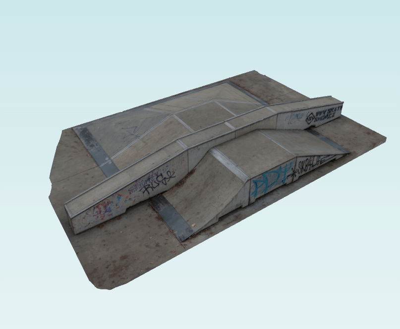
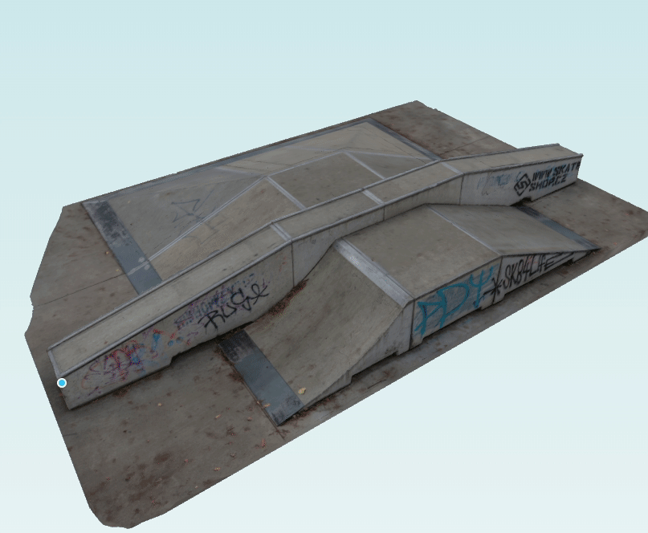

# xeokit-performance-textures-demo

## Overview

Introduces the ability to load triangle meshes with color texture from glTF. This allows us to view textured photogrammetry meshes converted from point clouds.

## NPM Package

Pre-release of the feature branch on [npm](https://www.npmjs.com/package/@xeokit/xeokit-sdk):

* @xeokit/xeokit-sdk 2.2.5-performance-textures-beta

## Examples

---

* [Viewing a photogrammetry scan from glTF](https://xeolabs.github.io/xeokit-performance-textures-demo/examples/loading_glTF_photogrammetry)
* [Source code](https://github.com/xeolabs/xeokit-performance-textures-demo/blob/main/examples/loading_glTF_photogrammetry.html)
---

* [Slicing a photogrammetry scan from glTF](https://xeolabs.github.io/xeokit-performance-textures-demo/examples/gizmos_SectionPlanesPlugin_createWithMouse_photogrammetry)
* [Source code](https://github.com/xeolabs/xeokit-performance-textures-demo/blob/main/examples/gizmos_SectionPlanesPlugin_createWithMouse_photogrammetry.html)

---

* [Measuring distances on a photogrammetry scan from glTF](https://xeolabs.github.io/xeokit-performance-textures-demo/examples/measurements_distance_createWithMouse_photogrammetry)
* [Source code](https://github.com/xeolabs/xeokit-performance-textures-demo/blob/main/examples/measurements_distance_createWithMouse_photogrammetry.html)

---

* [Measuring angles on a photogrammetry scan from glTF](https://xeolabs.github.io/xeokit-performance-textures-demo/examples/measurements_angle_createWithMouse_photogrammetry)
* [Source code](https://github.com/xeolabs/xeokit-performance-textures-demo/blob/main/examples/measurements_angle_createWithMouse_photogrammetry.html)

---

## Docs

* [API Docs](https://xeolabs.github.io/xeokit-performance-textures-demo//docs)

## Issues

1. Some geometries loaded by XKTLoaderPlugin are positioned incorrectly. This is a breakage in the transforms for those objects, an easy fix.

## Next Steps

1. Finish XKTLoaderPlugin support for textures
2. Finish XKT format with textures
3. Finish convert2xkt for textures